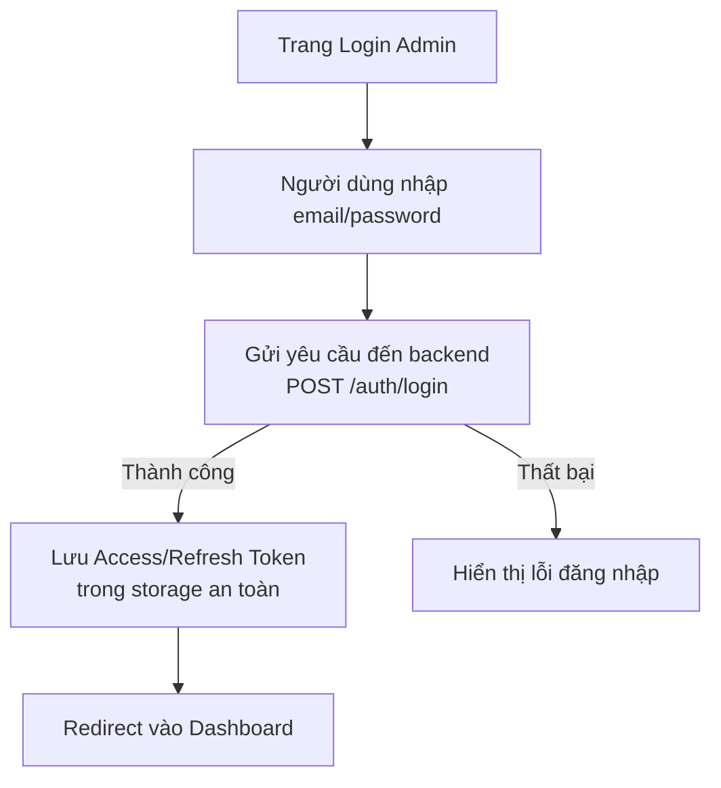

# Electronics Admin - Hệ Thống Quản Trị Cửa Hàng Linh Kiện Điện Tử

## 📋 Giới Thiệu Chung

**Electronics Admin** là nền tảng quản trị trung tâm dành cho hệ thống cửa hàng kinh doanh linh kiện điện tử. Được xây dựng trên nền tảng công nghệ hiện đại với **React 19**, **TypeScript** và **Vite**, ứng dụng cung cấp một trải nghiệm quản lý mượt mà, nhanh chóng và hiệu quả.

Hệ thống giúp giải quyết toàn diện các bài toán vận hành: từ quản lý kho hàng, xử lý đơn hàng, chăm sóc khách hàng đến theo dõi dòng tiền và báo cáo thống kê.

### 📞 Thông Tin Liên Hệ & Hỗ Trợ
Nếu bạn cần hỗ trợ kỹ thuật, file `.env` mẫu để chạy thử, hoặc có thắc mắc, vui lòng liên hệ:
- **Zalo**: [0827733475](https://zalo.me/0827733475)
- **Email**: [levanduy.work@gmail.com](mailto:levanduy.work@gmail.com)

---

## ✨ Tính Năng Chi Tiết

Hệ thống cung cấp các module quản trị chuyên sâu:

### 1. 📊 Dashboard (Tổng Quan)
Nơi cung cấp cái nhìn tổng quát về tình hình kinh doanh.
- **Thống kê số liệu**: Tổng số sản phẩm, đơn hàng, người dùng, voucher và lượt đánh giá.
- **Doanh thu ước tính**: Hiển thị tổng doanh thu từ các đơn hàng.
- **Đơn hàng mới nhất**: Danh sách 5 đơn hàng gần nhất cần xử lý.
- **Biểu đồ tăng trưởng**: *(Dự kiến phát triển)* Trực quan hóa doanh thu theo thời gian.

### 2. 📦 Quản Lý Sản Phẩm (Products)
Module cốt lõi quản lý kho linh kiện.
- **Thông tin chi tiết**: Tên, mã SKU, giá bán/gốc, mô tả.
- **Thông số kỹ thuật (Specs)**: Cho phép thêm các trường thông số động (Điện áp, Kích thước, v.v.).
- **Quản lý hình ảnh**: Upload và xem trước nhiều hình ảnh sản phẩm.
- **Phân loại**: Gán danh mục để tích hợp với App người dùng.
- **Datasheet**: Đính kèm tài liệu kỹ thuật PDF.

### 3. 📉 Quản Lý Kho (Inventory)
Theo dõi biến động hàng hóa.
- **Phiếu Nhập/Xuất**: Tạo phiếu nhập kho (Inbound) và xuất kho (Outbound) chi tiết.
- **Lịch sử**: Ghi lại thời gian, loại phiếu và người thực hiện.
- **Cảnh báo tồn kho**: *(Dự kiến phát triển)* Thông báo khi hàng sắp hết.

### 4. 🛒 Quản Lý Đơn Hàng (Orders)
Quy trình xử lý đơn hàng khép kín.
- **Quy trình trạng thái**:
  1. `ordered` (Đã đặt)
  2. `confirmed` (Đã xác nhận)
  3. `packaged` (Đóng gói)
  4. `shipped` (Giao hàng)
  5. `delivered` (Thành công)
  6. `cancelled` (Đã hủy)
- **Xử lý sự cố**: Hỗ trợ **Hủy đơn** hoặc **Hoàn tác** trạng thái sai sót.
- **Thanh toán**: Theo dõi trạng thái thanh toán (COD/Online).

### 5. 👥 Quản Lý Người Dùng (Users)
Quản trị tài khoản khách hàng và nhân viên.
- **CRUD Tài khoản**: Thêm, sửa, xóa người dùng.
- **Phân quyền**: Cấp quyền `Admin` hoặc `Customer`.
- **Tặng Voucher**: Cấp mã giảm giá riêng trực tiếp cho từng tài khoản.
- **Khóa tài khoản**: *(Dự kiến phát triển)* Chặn người dùng vi phạm.

### 6. 🚚 Quản Lý Vận Chuyển (Shipments)
- **Theo dõi vận đơn**: Quản lý các đơn hàng đang vận chuyển (In Transit, Out for Delivery).
- **Trạng thái COD**: Xác nhận đã thu tiền COD từ đơn vị vận chuyển.
- **Tạo vận đơn nhanh**: Tự động tạo phiếu giao hàng từ đơn hàng.

### 7. 🎫 Quản Lý Voucher (Khuyến Mãi)
- **Loại mã**: Giảm theo số tiền cố định, phần trăm (%), hoặc miễn phí vận chuyển.
- **Cấu hình**: Thiết lập đơn hàng tối thiểu, mức giảm tối đa, ngày hết hạn.
- **Phát hành**: Kích hoạt voucher cho toàn hệ thống.

### 8. ⭐ Quản Lý Đánh Giá (Reviews)
- **Kiểm duyệt**: Xem nội dung đánh giá và số sao từ khách hàng.
- **Xử lý**: Xóa các đánh giá không phù hợp.

### 9. 💰 Quản Lý Giao Dịch (Transactions)
- **Lịch sử thanh toán**: Ghi nhận giao dịch từ các cổng thanh toán (MoMo, ZaloPay, Bank).
- **Chi tiết**: Mã giao dịch, số tiền, thời gian và trạng thái.

### 10. 🔔 Quản Lý Thông Báo (Notifications)
- **Push Notification**: Gửi thông báo đến App người dùng.
- **Phân loại**: Thông báo chung hoặc cá nhân hóa.

### 11. 🖼️ Quản Lý Banner
- **Cấu hình Home App**: Thêm/Sửa/Xóa banner quảng cáo trên ứng dụng Mobile.
- **Điều hướng**: Gắn liên kết đến sản phẩm/danh mục cụ thể.

---

## 🏗️ Kiến Trúc Hệ Thống

Dự án tổ chức theo cấu trúc `feature-based` tiêu chuẩn:

```
electronics-admin/
├── src/
│   ├── api/                # Client Axios & Socket.IO
│   ├── auth/               # Auth Context & Guards
│   ├── components/         # Reusable UI Components
│   ├── hooks/              # Custom Hooks (useDbChange, useAuth)
│   ├── pages/              # Main Screens (Page Components)
│   ├── utils/              # Helpers & Formatters
│   ├── App.tsx             # Main App & Routing
│   └── main.tsx            # Entry Point
```

### Sơ đồ kiến trúc Admin & Backend

```mermaid
flowchart LR
    A[Admin Web - electronics-admin<br/>React + Vite] -->|HTTP / WebSocket| B[electronics-backend (NestJS API)]
    B --> C[(MongoDB)]
    B --> D[Cloudinary]
    B --> E[VNPay]
    B --> F[Firebase Admin<br/>Notifications & Token Verify]
    B --> G[AI Service (Gemini)]
```

### Công Nghệ Sử Dụng

*   **Frontend Framework**: React 19
*   **Language**: TypeScript 5.9
*   **Build Tool**: Vite 7
*   **UI Library**: Material UI (MUI) v7
*   **Form**: React Hook Form
*   **Network**: Axios
*   **Real-time**: Socket.IO Client

---

## 🚀 Hướng Dẫn Cài Đặt & Chạy

### 1. Clone repository
```bash
git clone <repository-url>
cd electronics-admin
```

### 2. Cài đặt dependencies
```bash
npm install
```

### 3. Cấu hình Environment Variables
Tạo file `.env` tại thư mục gốc:
```env
# API Configuration
VITE_API_URL=http://localhost:3000
```
> *Lưu ý: Liên hệ Admin để lấy cấu hình chuẩn nếu cần.*

#### Ghi chú bảo mật

- File `.env` **đã được ignore** trong `.gitignore`, tuyệt đối không commit lên repository.
- `VITE_API_URL` nên trỏ tới backend `electronics-backend` đã được cấu hình đầy đủ (bao gồm xác thực JWT, social login Google/Apple, thanh toán, v.v.).

### 4. Chạy ứng dụng (Development)
```bash
npm run dev
```
Truy cập: `http://localhost:5173`

### 5. Build Production
```bash
npm run build
# Preview build
npm run preview
```

---

## 🔐 Đăng Nhập & Bảo Mật

- **Cơ chế**: JWT Authentication (Access Token & Refresh Token).
- **Phân quyền**:
  - Dữ liệu được bảo vệ dựa trên Role (`admin`).
  - Token tự động đính kèm vào Header `Authorization`.
  - Tự động logout khi hết phiên đăng nhập.
- **Backend phụ thuộc**: Toàn bộ auth, phân quyền, social login, thanh toán... được xử lý bởi service `electronics-backend`; admin chỉ là client giao tiếp qua REST API / WebSocket.

### Lưu đồ luồng đăng nhập Admin



---

Dự án được phát triển và duy trì bởi **Electronics Shop Team**.
