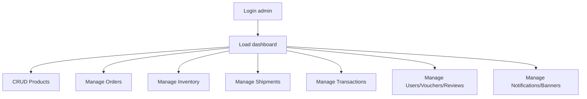
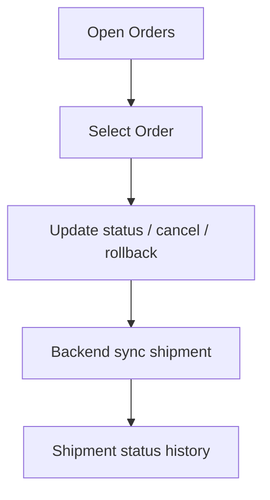
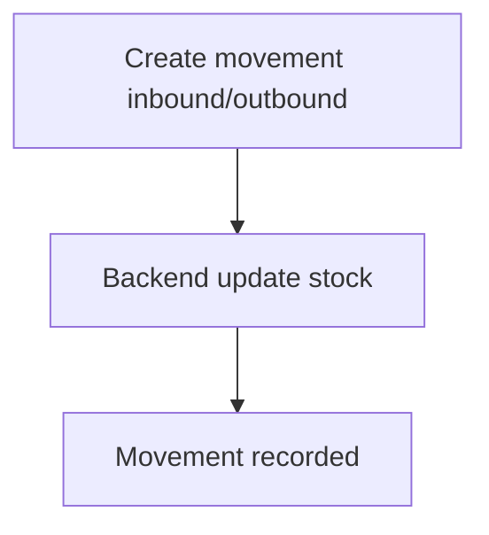
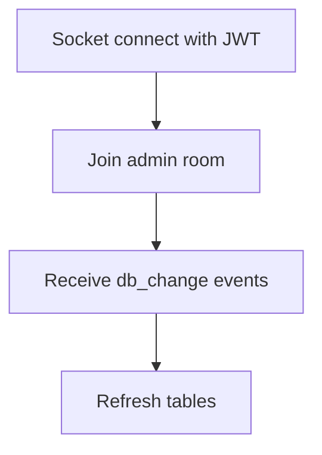

# ElectronicsShop Admin

Admin dashboard để quản trị toàn bộ hệ thống ElectronicsShop: sản phẩm, đơn hàng, tồn kho, thanh toán, banner và thông báo.

## Tech Stack
- Vite + React
- MUI
- TanStack Query
- Socket.IO client

## Cấu hình môi trường
Tạo `.env`:

```env
VITE_API_URL=http://localhost:3000
```

## Cài đặt và chạy
```bash
npm install
npm run dev
```

## Module quản trị
- Dashboard tổng quan
- Products + Product Detail
- Orders + Order Detail
- Shipments
- Inventory Movements
- Transactions
- Users
- Vouchers
- Reviews
- Notifications
- Banners

## Flow tổng thể (Admin)


## Flow Orders + Shipments


## Flow Inventory


## Realtime DB Change


## Ghi chú
- Cần tài khoản role `admin`.
- Admin app tự refresh token qua `/auth/refresh` khi access token hết hạn.
- Backend cần cấu hình CORS cho domain admin.

## Liên quan
- Backend: `/Users/levanduy/Nam4/HK2/Mobile/ElectroAI/electronics-backend/README.md`
- Mobile: `/Users/levanduy/Nam4/HK2/Mobile/ElectroAI/ElectronicsShop/README.md`
- Tổng quan hệ thống: `/Users/levanduy/Nam4/HK2/Mobile/ElectroAI/readme.md`
