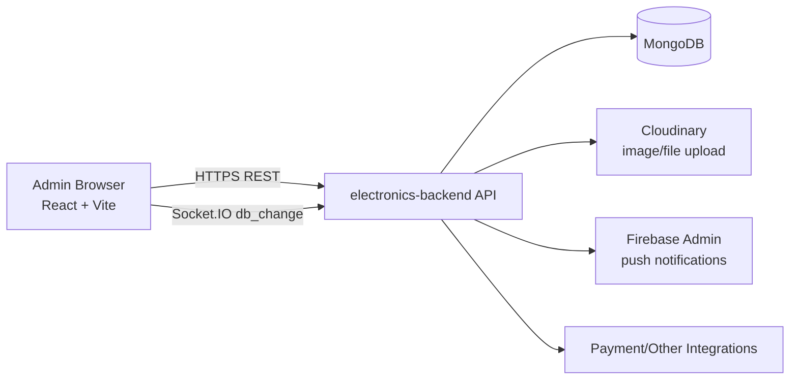
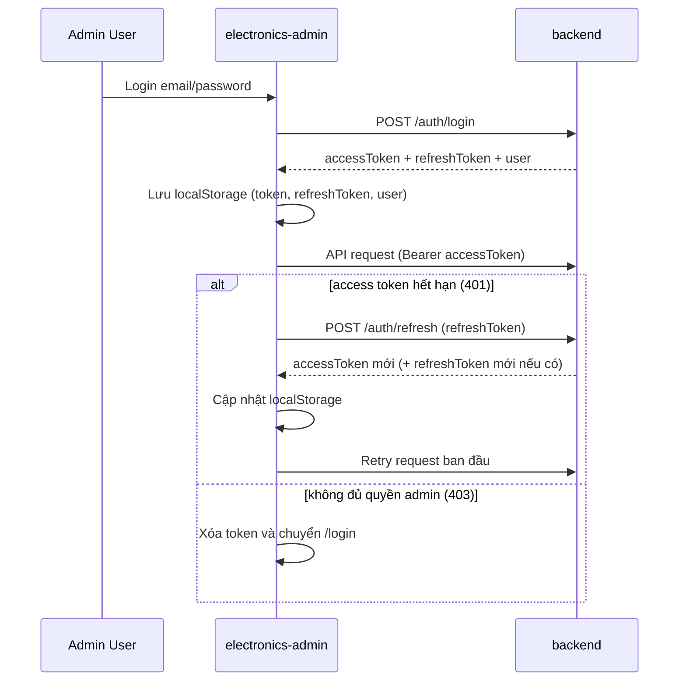
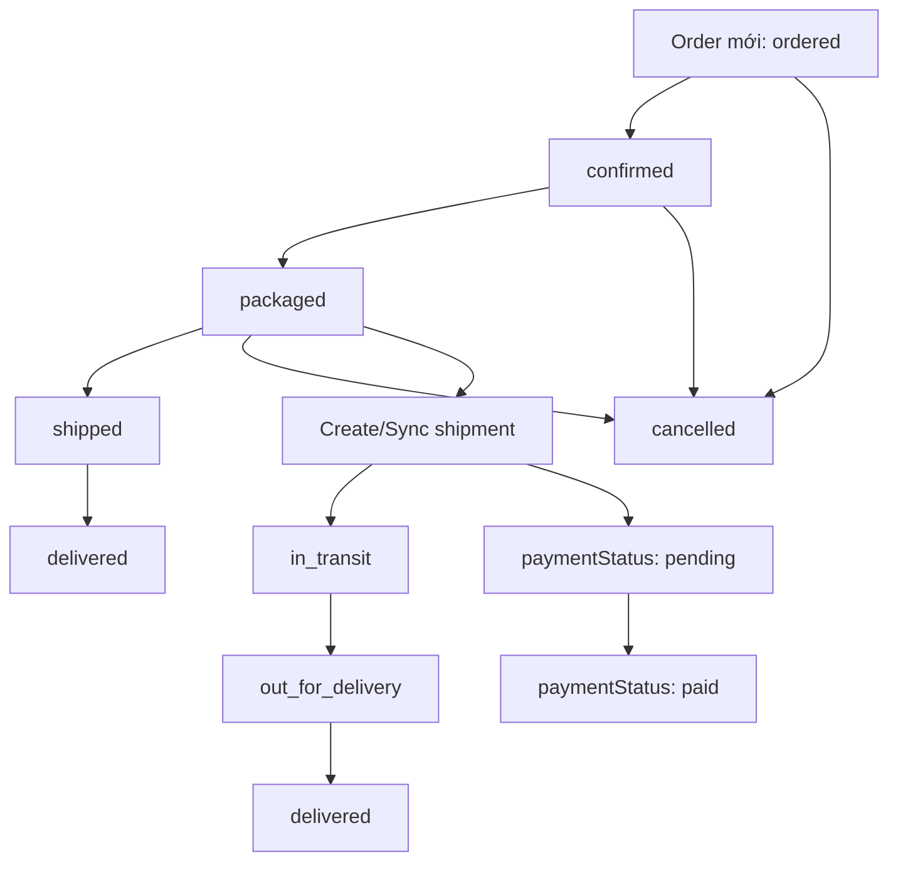

# Electronics Admin

Trang quản trị cho hệ thống **Electronics Shop**, xây bằng **React 19 + TypeScript + Vite**. Ứng dụng phục vụ vận hành nội bộ: quản lý sản phẩm, đơn hàng, vận đơn, kho, giao dịch, người dùng, voucher, đánh giá, banner, thông báo.

## 1. Mục tiêu dự án

- Quản trị tập trung dữ liệu vận hành từ backend `electronics-backend`.
- Cập nhật dữ liệu nhanh qua REST API + realtime `socket.io` (`db_change`).
- Kiểm soát quyền truy cập admin bằng JWT + refresh token.

## 2. Công nghệ chính

- `React 19`, `TypeScript 5`, `Vite 7`
- `Material UI` + `MUI DataGrid`
- `@tanstack/react-query` để fetch/cache/invalidate dữ liệu
- `Axios` + interceptor tự đính kèm token và tự refresh
- `socket.io-client` để đồng bộ realtime theo collection
- `react-hook-form` cho form CRUD

## 3. Kiến trúc tổng thể



## 4. Luồng xác thực và refresh token



## 5. Realtime đồng bộ dữ liệu

Hook `useDbChange()` lắng nghe event `db_change` từ backend. Khi có thay đổi collection quan tâm (products/orders/shipments/...), trang hiện tại sẽ gọi `invalidateQueries` để tự refetch.

```mermaid
flowchart TD
  A[MongoDB Change Stream ở backend] --> B[Emit socket event: db_change]
  B --> C[Frontend useDbChange(collections)]
  C --> D{collection có nằm trong danh sách theo dõi?}
  D -->|Có| E[React Query invalidateQueries]
  D -->|Không| F[Bỏ qua]
  E --> G[Refetch API]
  G --> H[UI cập nhật]
```

## 6. Luồng nghiệp vụ đơn hàng - vận đơn



## 7. Chức năng theo module

| Module | Mô tả chính | Endpoint chính |
|---|---|---|
| Dashboard | Thống kê nhanh products/orders/users/vouchers/reviews + doanh thu ước tính | `GET /products`, `GET /orders`, `GET /users`, `GET /vouchers`, `GET /reviews` |
| Products | CRUD sản phẩm, specs động, options/classifications, ảnh + datasheet upload | `GET/POST/PATCH/DELETE /products`, `POST /upload/image`, `POST /upload/image/by-url`, `POST /upload/file` |
| Orders | Theo dõi vòng đời đơn, cập nhật status, hủy/rollback/xóa, mở chi tiết | `GET /orders`, `PATCH /orders/:id`, `DELETE /orders/:id` |
| Order Detail | Xem chi tiết 1 đơn hàng | `GET /orders/:id` |
| Shipments | CRUD vận đơn, cập nhật trạng thái giao hàng và COD | `GET/POST/PATCH/DELETE /shipments` |
| Inventory | CRUD phiếu nhập/xuất kho | `GET /inventory-movements`, `POST/PATCH/DELETE /inventory-movements/:id` |
| Transactions | CRUD giao dịch thanh toán | `GET/POST/PATCH/DELETE /transactions` |
| Users | CRUD user, đổi role, gán voucher cho user | `GET/POST/PATCH/DELETE /users`, `POST /users/:id/vouchers` |
| Vouchers | CRUD voucher | `GET/POST/PATCH/DELETE /vouchers` |
| Reviews | Xem danh sách, lọc theo product, xóa review | `GET /reviews`, `DELETE /reviews/:id` |
| Notifications | Gửi/cập nhật/xóa thông báo admin (all users hoặc user cụ thể) | `GET /notifications/admin/all`, `POST/PATCH/DELETE /notifications/admin/:id` |
| Banners | CRUD banner, upload ảnh, reorder hiển thị | `GET/POST/PATCH/DELETE /banners`, `PATCH /banners/reorder` |

## 8. Cấu trúc thư mục

```text
electronics-admin/
├── src/
│   ├── api/
│   │   ├── client.ts           # Axios instance + auth interceptors
│   │   └── socket.ts           # Singleton socket.io client
│   ├── auth/
│   │   └── AuthContext.tsx     # Auth state + bootstrap session
│   ├── components/
│   │   └── Layout.tsx          # Shell (sidebar/topbar/outlet)
│   ├── hooks/
│   │   └── useDbChange.ts      # Realtime db_change listener
│   ├── pages/                  # Các trang nghiệp vụ
│   ├── utils/
│   │   ├── uploads.ts          # Upload image/file qua backend
│   │   └── slugify.ts
│   ├── App.tsx                 # Router + ProtectedRoute
│   └── main.tsx                # React Query provider
├── .env.example
└── package.json
```

## 9. Điều kiện môi trường

- `Node.js >= 20` (khuyến nghị dùng bản LTS mới)
- `npm >= 10`
- Backend `electronics-backend` chạy sẵn và cho phép tài khoản role `admin`

## 10. Cấu hình biến môi trường

Tạo file `.env` tại thư mục `electronics-admin`:

```env
VITE_API_URL=http://localhost:3000
```

Nếu deploy backend nơi khác, đổi `VITE_API_URL` tương ứng.

## 11. Cài đặt và chạy

```bash
cd electronics-admin
npm install
npm run dev
```

Mặc định Vite chạy ở `http://localhost:5173`.

Build production:

```bash
npm run build
npm run preview
```

Lint:

```bash
npm run lint
```

## 12. Routing chính

- `/login`
- `/`
- `/products`
- `/products/:id`
- `/orders`
- `/orders/:id`
- `/shipments`
- `/inventory`
- `/transactions`
- `/users`
- `/vouchers`
- `/reviews`
- `/notifications`
- `/banners`

## 13. Cơ chế bảo mật hiện tại

- Route bảo vệ bằng `ProtectedRoute`.
- Bootstrap session khi load app: đọc localStorage, gọi thử endpoint admin (`GET /users`) để xác thực quyền.
- `401`: thử refresh token 1 lần, thất bại thì logout cứng.
- `403`: logout cứng ngay (token hợp lệ nhưng không có quyền admin).
- Token được gửi qua header `Authorization: Bearer <token>`.

## 14. Ghi chú vận hành

- Dự án hiện chưa có test tự động (`unit/e2e`) trong repo admin.
- Dữ liệu nhiều trang đang dùng polling định kỳ (`refetchInterval`) kết hợp realtime event.
- Upload ảnh/file đi qua backend (không upload trực tiếp từ client lên Cloudinary).

## 15. Troubleshooting nhanh

- Lỗi không gọi được API: kiểm tra `VITE_API_URL` và backend đang chạy.
- Bị bật về `/login`: thường do token hết hạn, refresh token sai hoặc user không phải role `admin`.
- Không thấy dữ liệu realtime: kiểm tra websocket/proxy và backend có emit `db_change`.

---

## Liên hệ

- Email: `levanduy.work@gmail.com`
- Zalo: `0827733475`
